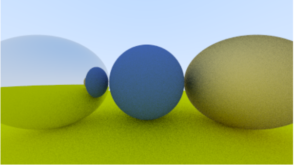
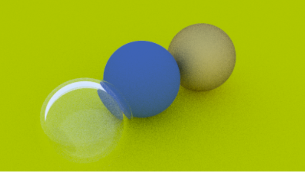
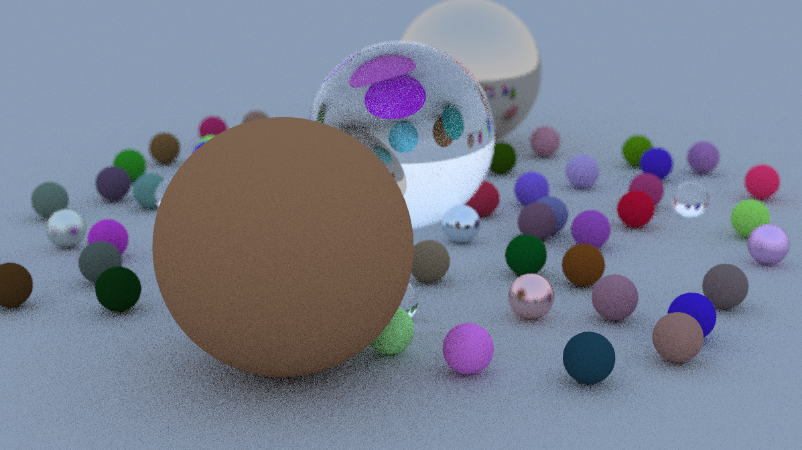

# Ray Tracer From Scatch
### What is Ray Tracing?
Ray tracing is a rendering technique for generating an image by tracing the path of light as pixels in an image plane and simulating the effects of its encounters with virtual objects.
Ray tracing is capable of producing a very high degree of visual realism, usually higher than that of typical scanline rendering methods, but at a greater computational cost.
### Features Implemented
This project implements a basic ray tracer with the following features:

- Positionable camera
- Antialiasing
- Diffuse materials
- Metal
- Dielectrics (like glass)
- Positionable camera with depth of field

Here are some sample renders from the project:

 Metal sphere (left), Lambertian sphere (center), Fuzzy metal sphere (right)

 Hollow Glass sphere (left)

 Glass Sphere (center)

### Running the Ray Tracer
To compile and run the ray tracer, follow these steps:

1. Clone this repository
2. Navigate to the project directory
3. Compile the main.cc file using the following command:
```g++ main.cc -o output.exe```
4. Run the compiled executable and redirect the output to a PPM file:
```./output.exe > image.ppm```
5. Open the image.ppm file in an image viewer or convert it to another format (e.g., PNG) for viewing.


### Acknowledgments
This ray tracer was built by following the excellent book series "Ray Tracing in One Weekend" by Peter Shirley, Trevor David Black, Steve Hollasch.
https://raytracing.github.io/books/RayTracingInOneWeekend.html#dielectrics/modelingahollowglasssphere
